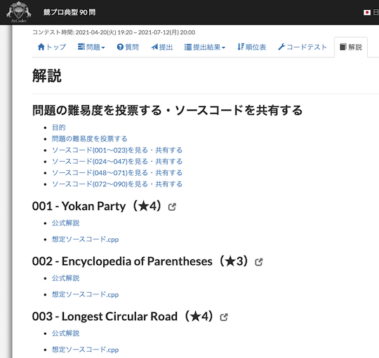
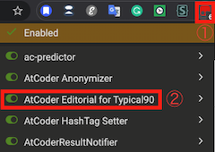

# AtCoder-Editorial-for-Typical90

## 概要

[AtCoder](https://atcoder.jp/)の「[競プロ典型 90 問](https://atcoder.jp/contests/typical90)」に解説タブを追加し、[E869120](https://atcoder.jp/users/E869120)さんが[GitHub](https://github.com/E869120/kyopro_educational_90)で公開されている問題の解説・想定ソースコードなどのリンクを表示します。

(2021年6月6日追記) [競プロ典型 90 問](https://atcoder.jp/contests/typical90)のトップページで、ほぼ同等の機能が追加されています。最新の情報は、主に土日に更新されるようです。

***DEMO***

  

## 機能

普段のコンテストの「解説」タブと、ほぼ同じ仕様です。

- [競プロ典型 90 問](https://atcoder.jp/contests/typical90)に、解説タブを追加

- 解説タブに、以下のリンクを追加
  - [非公式難易度表・ソースコード共有](https://docs.google.com/spreadsheets/d/1GG4Higis4n4GJBViVltjcbuNfyr31PzUY_ZY1zh2GuI/edit#gid=0)へのリンク
  - 各問題のリンク
  - [GitHub](https://github.com/E869120/kyopro_educational_90)で公開されている問題別の解説、想定ソースコードへのリンク

## インストール方法

1. 初めてスクリプトマネージャーを利用される場合は、「[Tampermonkey](https://www.tampermonkey.net/)」をインストールします。
2. [本スクリプト](https://greasyfork.org/ja/scripts/427584-atcoder-editorial-for-typical90)をインストールします。
3. Tampermonkeyのアイコンをクリックして、本スクリプトを有効にします。

  

### 動作環境

- ユーザースクリプトマネージャとしてTampermonkeyを推奨しています。

## 注意事項

- 1つの問題に対して、複数の解説・想定ソースコードが公開されている日があります。アドホックな処理をしているため、<b>定期的なスクリプトのアップデート</b></a>をお願いいたします。ご不便をお掛けしますが、よろしくお願いいたします。

## バグ・不具合の報告・要望・感想など

- お気軽にTwitter([@KATO-Hiro](https://twitter.com/k_hiro1818))か、[GitHub](https://github.com/KATO-Hiro/AtCoder-Editorial-for-Typical90)まで、ご一報いただけると幸いです。

## 関連リンク

[AtCoder](https://atcoder.jp/)

[AtCoder 競プロ典型90問](https://atcoder.jp/contests/typical90)

[add-typical90-link](https://greasyfork.org/ja/scripts/427326-add-typical90-link)

[Readme Driven Development; RDD](https://qiita.com/b4b4r07/items/c80d53db9a0fd59086ec)

## ライセンス

[CC0](https://creativecommons.org/share-your-work/public-domain/cc0)
